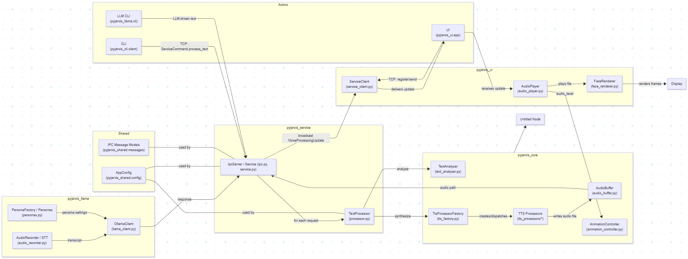

# PyJarvis - AI Assistant

A Python implementation of the Jarvis text-to-voice assistant with animated digital face, LLM integration, and speech recognition.

## Architecture

Modular Python application following Clean Architecture, SOLID principles, and Design Patterns:

- **pyjarvis_shared**: Shared types, messages, and centralized configuration
- **pyjarvis_core**: Core domain logic (text analysis, TTS processors, audio processing, animations)
- **pyjarvis_service**: Service layer for text-audio processing (TCP IPC)
- **pyjarvis_cli**: CLI application to send text to service
- **pyjarvis_ui**: Desktop UI with animated robot face (Pygame)
- **pyjarvis_llama**: LLM integration with speech recognition (Ollama + RealtimeSTT)



## Requirements

- Python 3.10+
- FFmpeg (for MP3 processing) — see the "Install FFmpeg" section below
- Optional: Ollama (for LLM features)
- See `requirements.txt` for all dependencies

## Installation

```bash
pip install -r requirements.txt
```

## Quick Start

### Full architecture (recommended)

1. Start the service in terminal 1:

```bash
python -m pyjarvis_service
```

2. Start the UI in terminal 2:

```bash
python -m pyjarvis_ui
```

3. Send text from terminal 3:

```bash
python -m pyjarvis_cli "Hello, I am Jarvis"
```

### LLM + Speech Recognition (optional)

1. Start Ollama (if using local LLM):

```bash
ollama serve
```

2. Start the service and UI as above.
3. Start the LLM CLI in another terminal:

```bash
python -m pyjarvis_llama
```

In the LLM CLI you can:
- Type messages and press Enter for text input
- Use `/m` to record audio from microphone (press Enter to stop)
- Use `/lang <code>` to change recognition language
- Use `/persona <name>` to change AI persona

### Standalone UI

The UI can run standalone but is much more useful connected to the service:

```bash
python -m pyjarvis_ui
```


## Project Structure

Top-level layout (canonical):

```
pyJarvis/
├── README.md
├── requirements.txt
├── pyjarvis_shared/
├── pyjarvis_core/
├── pyjarvis_service/
├── pyjarvis_cli/
├── pyjarvis_ui/
├── pyjarvis_llama/
├── audio/
├── assets/
├── models/
└── docs/
```

- `pyjarvis_shared/`: AppConfig, message types and shared utilities
- `pyjarvis_core/`: TextAnalyzer, AnimationController, TTS factory and processors
- `pyjarvis_service/`: IPC server and TextProcessor orchestration
- `pyjarvis_ui/`: Pygame-based UI (FaceRenderer, AudioPlayer, ServiceClient)
- `pyjarvis_llama/`: LLM CLI, Ollama client, STT recorder, personas

## Features

- Animated robot face with lip-sync and emotion-driven effects
- Multiple TTS engines (Edge-TTS default, gTTS available)
- STT integration via RealtimeSTT / Whisper models
- LLM support via Ollama and configurable AI personas
- TCP-based IPC; UI registers for broadcast updates from service

## Configuration

All runtime configuration is centralized in `pyjarvis_shared/config.py` (AppConfig):
- TTS processor selection (`tts_processor`)
- Audio output directory and auto-delete behavior
- Edge-TTS voice mapping (`edge_tts_voices`)
- STT model and language
- Ollama base URL and model


## Text-to-Speech (Quick notes)

- Edge-TTS (Microsoft) is the default high-quality engine. Voice mapping is configurable by language.
- gTTS (Google) is supported as a fallback (requires internet and FFmpeg for MP3→WAV conversion).


## Install FFmpeg

PyJarvis uses FFmpeg (via `pydub`) to convert MP3 audio (e.g., produced by gTTS) to WAV.

Windows options:

- Chocolatey (recommended):

```powershell
choco install ffmpeg
```

- winget:

```powershell
winget install ffmpeg
```

- Manual download:
  1. Download from: https://www.gyan.dev/ffmpeg/builds/
  2. Extract the ZIP and add the `bin` folder to your PATH (e.g. `C:\ffmpeg\bin`).
  3. Restart terminal.

Verify installation:

```powershell
ffmpeg -version
```

If you prefer not to install FFmpeg, use a TTS engine that emits WAV directly.


## Edge-TTS Voice Mapping

Configure voices in `pyjarvis_shared/config.py` (example):

```python
from pyjarvis_shared import AppConfig
config = AppConfig()
config.edge_tts_voices = {
    "pt-br": "pt-BR-HumbertoNeural",
    "pt": "pt-BR-FranciscaNeural",
    "en": "en-US-AriaNeural",
    "en-us": "en-US-GuyNeural"
}
```

### Available Voices

### Portuguese (pt-BR) example voices
- `pt-BR-FranciscaNeural` - female (padrão)
- `pt-BR-HumbertoNeural` - male
- `pt-BR-AntonioNeural` - male
- `pt-BR-BrendaNeural` - female
- `pt-BR-DonatoNeural` - male
- `pt-BR-ElzaNeural` - female
- `pt-BR-FabioNeural` - male
- `pt-BR-GiovannaNeural` - female
- `pt-BR-JulioNeural` - male
- `pt-BR-LeilaNeural` - female
- `pt-BR-LeticiaNeural` - female
- `pt-BR-ManuelaNeural` - female
- `pt-BR-NicolauNeural` - male
- `pt-BR-ThalitaNeural` - female
- `pt-BR-ValerioNeural` - male
- `pt-BR-YaraNeural` - female

### English (en-US) example voices
- `en-US-AriaNeural` - female (padrão)
- `en-US-GuyNeural` - male
- `en-US-JennyNeural` - female
- `en-US-AmberNeural` - female
- `en-US-AnaNeural` - female (child)
- `en-US-AshleyNeural` - female
- `en-US-BrandonNeural` - male
- `en-US-ChristopherNeural` - male
- `en-US-CoraNeural` - female
- `en-US-ElizabethNeural` - female
- `en-US-EricNeural` - male
- `en-US-JacobNeural` - male
- `en-US-JaneNeural` - female
- `en-US-JasonNeural` - male
- `en-US-MichelleNeural` - female
- `en-US-MonicaNeural` - female
- `en-US-NancyNeural` - female
- `en-US-RogerNeural` - male
- `en-US-SaraNeural` - female
- `en-US-TonyNeural` - male

## Testing / Verification

Quick test flow:

1. Start the service: `python -m pyjarvis_service` (should listen on 127.0.0.1:8888)
2. Start the UI: `python -m pyjarvis_ui` (window should open and attempt to connect)
3. Send text via CLI: `python -m pyjarvis_cli "Hello, I am Jarvis"`

Expected: service processes text, generates an audio file in `./audio/`, broadcasts a VoiceProcessingUpdate, and the UI plays the audio while animating the face.

Testing checklist (manual):
- [ ] Service starts without errors
- [ ] UI connects to service
- [ ] CLI can send text
- [ ] Audio is generated and played
- [ ] Robot face animates during speech
- [ ] Audio files are cleaned up (if configured)
- [ ] LLM CLI connects to Ollama (if used)
- [ ] Speech recognition works (`/m` in LLM CLI)